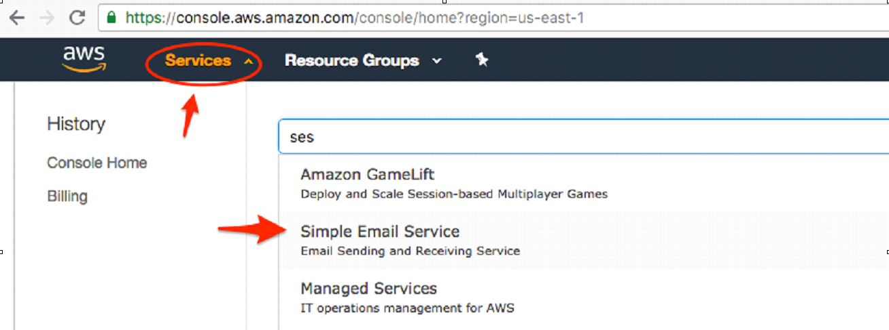
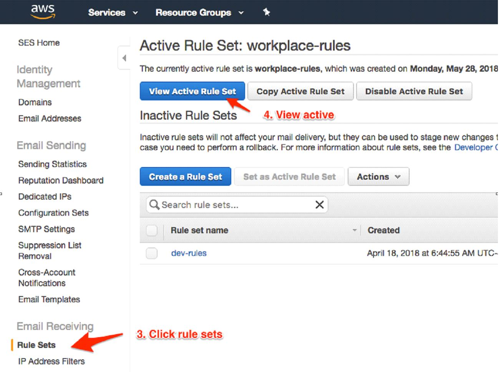
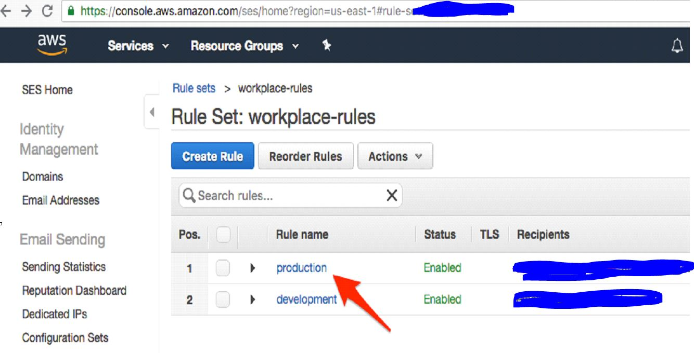

# How to add a new office to Amazon SES

## Log in to the AWS console at aws.amazon.com

* Click on “Services” and search for SES \(Simple Email Service\)


Your AWS region might be different


## Configure the client's email address

* Click “Rule Sets” in the sidebar.
* Click “View Active Rule Set”.

* Click "Production"

