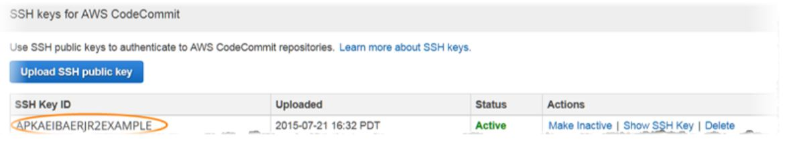

# How to configure and access codecommit repositories

## **Step 1: Associate Your Public Key with Your IAM User**

* Sign in to the AWS Management Console and open the IAM console at [https://console.aws.amazon.com/iam/](https://console.aws.amazon.com/iam/).
* In the IAM console, in the navigation pane, choose Users, and from the list of users, choose your IAM user.
* On the Security Credentials tab, choose Upload SSH public key.
* Paste the contents of your SSH public key into the field, and then choose Upload SSH Key.
* 

The public/private key pair must be SSH-2 RSA, in OpenSSH format, and contain 2048 bits. The key will look similar to this:

```text
ssh-rsa EXAMPLE-AfICCQD6m7oRw0uXOjANBgkqhkiG9w0BAQUFADCBiDELMAkGA1UEBhMCVVMxCzAJB
gNVBAgTAldBMRAwDgYDVQQHEwdTZWF0dGxlMQ8wDQYDVQQKEwZBbWF6b24xFDASBgNVBAsTC0lBTSBDb25
zb2xlMRIwEAYDVQQDEwlUZXN0Q2lsYWMxHzAdBgkqhkiG9w0BCQEWEG5vb25lQGFtYXpvbi5jb20wHhcNM
TEwNDI1MjA0NTIxWhcNMTIwNDI0MjA0NTIxWjCBiDELMAkGA1UEBhMCVVMxCzAJBgNVBAgTAldBMRAwDgY
DVQQHEwdTZWF0dGxlMQ8wDQYDVQQKEwZBbWF6b24xFDAS=EXAMPLE user-name@ip-192-0-2-137
```

IAM accepts public keys in the OpenSSH format only. If you provide your public key in another format, you will see an error message stating the key format is not valid.


* Copy the SSH key ID \(for example, APKAEIBAERJR2EXAMPLE\) and close console.



## **Step 2: Add AWS CodeCommit to Your SSH Configuration**

* At the terminal \(Linux, macOS, or Unix\) or bash emulator \(Windows\), edit your SSH configuration file by typing cat&gt;&gt; ~/.ssh/config:

```text
Host git-codecommit.*.amazonaws.com
User Your-SSH-Key-ID, such as APKAEIBAERJR2EXAMPLE
IdentityFile Your-Private-Key-File, such as ~/.ssh/codecommit_rsa or ~/.ssh/id_rsa
```


If you have more than one SSH configuration, make sure you include the blank lines before and after the content. Save the file by pressing the Ctrl and d keys simultaneously.


* Run the following command to test your SSH configuration:

```bash
ssh git-codecommit.us-east-1.amazonaws.com
```

Type the passphrase for your SSH key file when prompted. If everything is configured correctly, you should see the following success message:

```text
You have successfully authenticated over SSH. 
You can use Git to interact with AWS CodeCommit. 
Interactive shells are not supported. 
Connection to git-codecommit.us-east-2.amazonaws.com closed by remote host.
```

## **Step 3: Give access to the repository to your user**

1. In the IAM console, in the navigation pane, choose Users, and from the list of users, choose your IAM user.
2. On the Groups tab, choose Add user to groups.
3. Select the correct group with permissions to access the repository

## **Step 4: Clone and use the repository as usual**

```text
git clone ssh://git-codecommit.us-east-1.amazonaws.com/v1/repos/sample-repo
```

